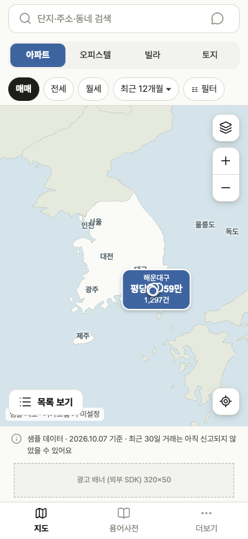
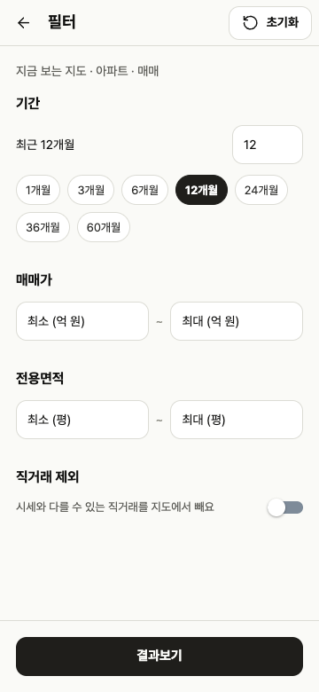

# UI 크기·지도 조작 검증

360×780 브라우저에서 확인한 수정 화면. 지도는 카카오 키가 없는 전국 샘플 배경이고 서버 거래 데이터도 sample 모드다.

- 검색 영역 40px, 지도 조작 버튼 38px
- 최초 화면에 서울·제주·동쪽 섬이 포함됨, 전국 SVG 이미지 실제 로드 확인
- 줌 버튼 0.25, 휠 0.12 변화 및 부드러운 전환
- 서울로 이동해도 부산 지원 팝업·거래 없음 카드가 남지 않음
- 직거래 제외 스위치의 꺼진 상태 대비 및 켠 상태의 실제 API 필터 반영
- 전체 테스트 19개·타입 검사·웹/iOS/Android 번들 통과
- 기존 검색·단지·거래이력·용어 화면 흐름에서 런타임 오류 0

